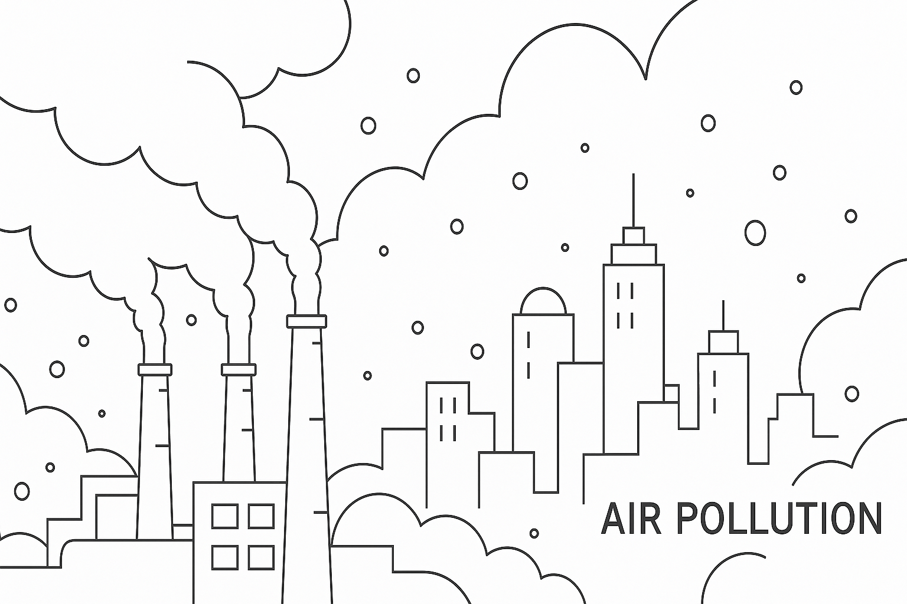

# Pollution Prediction



## 1. Project Motivation
Forecasting air pollution levels is critical for public health initiatives, urban planning, and environmental policy enforcement. Understanding pollution trends enables:

- **Health Alerts**: Issuing warnings for vulnerable groups (e.g., children, elderly) during high pollution periods.
- **Policy Making**: Guiding emissions reduction strategies and evaluating regulatory impacts.
- **Technical Demonstration**: Showcasing an end-to-end machine learning pipeline (data ingestion → feature engineering → modeling → deployment) on real-world open data, preparing for professional ML roles.

## 2. Data
We utilize the **Beijing Multi-Site Air Quality Data Set** from the UCI Machine Learning Repository:

- **Source**: [Beijing Multi-Site Air Quality Data](https://archive.ics.uci.edu/dataset/501/beijing+multi+site+air+quality+data)
- **Contents**: This data set includes hourly air pollutants data from 12 nationally-controlled air-quality monitoring sites. The air-quality data are from the Beijing Municipal Environmental Monitoring Center. The meteorological data in each air-quality site are matched with the nearest weather station from the China Meteorological Administration. The time period is from March 1st, 2013 to February 28th, 2017. Missing data are denoted as NA.
- Features: Hourly readings of PM₂.₅, PM₁₀, SO₂, NO₂, CO, O₃, and meteorological variables (temperature, humidity, wind speed) across five stations. 

## 3. How to Run
Follow these steps to reproduce the results:

```bash
# 1. Clone the repository
```bash
git clone https://github.com/Walsamer/pollution_prediction.git
cd pollution_prediction

# 2. Install dependencies
pip install -r requirements.txt

# 3. Download data
python src/data.py --download-url [Beijing Multi-Site Air Quality Data](https://archive.ics.uci.edu/dataset/501/beijing+multi+site+air+quality+data)

# 4. Preprocess & feature engineering
python src/data.py --run-preprocessing --config configs/default.yaml

# 5. Train the model
python src/train.py --config configs/default.yaml

# 6. Make predictions on new data
python src/predict.py \
  --input path/to/new_weather.csv \
  --output path/to/predictions.csv \
  --config configs/default.yaml
